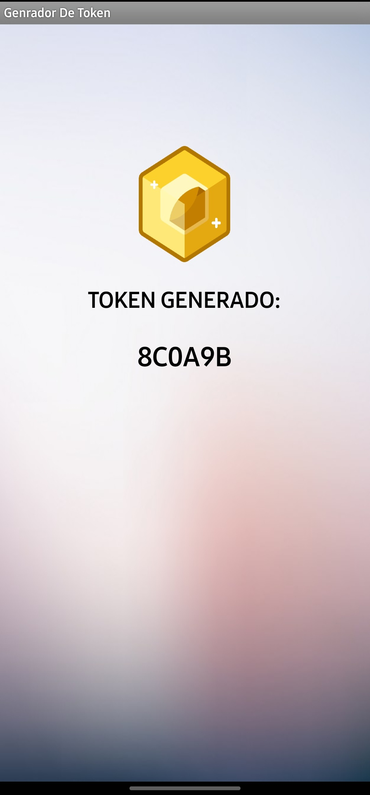

# Práctica 2 - Manual De Usuario

## INTEGRANTES
| Nombre                           | Carné                                      |
|:--------------------------------:|:------------------------------------------:|
| Daniel Reginaldo Dubón Rodríguez | 201901772                                  |
| Erick Ivan Mayorga Rodríguez     | 201901758                                 	|
| Edmy Marleny Mendoza Pol         | 201901212                                	|
| Kevin Steve Martínez Lemus       | 202004816                  				|

## Funciones de la Aplicación
- Login / Inicio de sesión del usuario o administrador.
- CRUD de usuarios desde cuenta de administrador.
- Ver reportes desde cuenta de administrador.
- Procesar paquetes y despachar paquetes desde cuenta de usuario.
- Logout del usuario o administrador.
- Creación de nombres de usuario. 

## Setup - Mensaje Inicial

Al inciar el arduino, en la pantalla LCD se podrá observar el mensaje incial correspondiente a: "🡆Bienvenido🡄" en la línea superior y "Grupo13-SeccionA" en la línea inferior, por aproximadamente 3 segundos. Al terminar el tiempo estipulado en el setup empezará el login del usuario indicando que inicie sesión.

 

### Login / Inicio de sesión

Al entrar en este modo, se mostrará un mensaje en la pantalla LCD para que inicie sesión colocando el usuario y la contraseña. En la aplicación Bluetooth se debe ingresar también con las mismas credenciales y se generará un token que deberá ser ingresado después en la línea. Si el usuario adminitrador se loggea entonces debe permitir ver los reportes tanto en la LCD como en la aplicación bluetooth.

### Flujo del login

 
 
 
 

Una vez que las credenciales sean correctas se procede a vincular la aplicacion bluetooth

 
 
 
 

Se ingresa el token generado por la aplicacion

 

Y la aplicacion redirigira a otra pantalla segun el tipo de usuario que se este logeando.

<b>Usuario normal</b>

Desde aca el usuario podra procesar y despachar paquetes

 
<b>Administrador</b>

El administrador podra ver los reportes de los usuarios y asi mismo cambiarles nombre

 

 
## CRUD de Usuarios

El CRUD de usuarios es una tarea exclusica del administrador, por lo que, se debe iniciar sesión colocando las credenciales del administrador. Se tienen las siguientes opciones:

 

 

 

- **Creación de usuarios :** se debe ingresar el código de usuario netamente númerico y el contraseña alfanumérico considerando únicamente las letras del teclado.
- **Modificación de usuarios :** se debe ingresar el código de usuario que se desea modificar, una vez encontrado, se debe ingresar el nuevo código de usuario y contraseña.
- **Ver usuarios guardados :** se observará un registro con todos los usuarios guardados hasta el momento. 
- **Eliminación de usuarios :** se deberá ingresar el código de usuario que se desea eliminar, una vez encontrado, se elimina tanto su código como contraseña de usuario. 

### Logout
En la aplicación Bluetooth se observá el botón de Logout, al ser presionado se desconcecta de la aplicacion bluetooth y de la aplicacion en arduino, para que otro usuario pueda volver a iniciar sesion.

 

### Reportes
Al entrar en este modo, se mostrará un mensaje en la pantalla LCD durante 3 segundos y brindará información por usuario de cantidad de paquetes procesados por tamaño y cantidad de envíos despechados por tamaño.

 

## Simulación de bandas

Aca se visualizara el procesado de los paquetes y su seleccion hasta llegar a la puerta correspondiente a su tamaño.

El color azul representara a los paquete pequeños, el color amarillo a los paquetes mediano y el intercambio de color entre azul y amarillo representara a los paquetes grandes.

 
