# Práctica 3 - Manual Técnico

## INTEGRANTES
| Nombre                           | Carné                                      |
|:--------------------------------:|:------------------------------------------:|
| Daniel Reginaldo Dubón Rodríguez | 201901772                                  |
| Erick Ivan Mayorga Rodríguez     | 201901758                                 	|
| Edmy Marleny Mendoza Pol         | 201901212                                	|
| Kevin Steve Martínez Lemus       | 202004816                  				|

## INTRODUCCIÓN

Se realizó un sistema automático que soluciona la distribución de paquetes hacia las puertas de embarque de una bodega de clasificación de paquetes dependiendo del tamaño de los mismos por medio de bandas transportadoras. La red funciona para varios usuarios y el administrador, presenta diversos estados como mensajes en una pantalla LCD, presenta los registros y estadísticas de los paquetes enviados dependiendo del tamaño, teniendo todos los registros así como los usuarios del sistema guardados en la memoria EEPROM. Se utilizó una red de Arduinos usando comunicación serial además de una aplicación Bluetooth para el manejo del sistema. 

## COMPONENTES UTILIZADOS
- <b>3 Arduinos Mega</b>  
Para controlar los diferentes modulos y darle funcionamiento a las partes
 
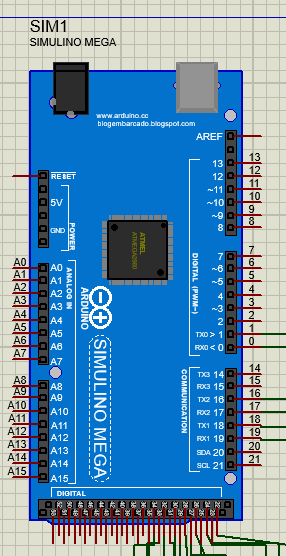 
- <b>1 Teclado alfanumérico matricial</b>  
Para poder ingresar caracteres en la apliacion
 
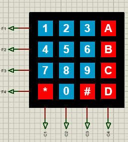 
- <b>8 Motores stepper</b>  
Para poder mover las bandas de distribucion
 
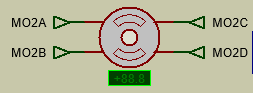 
- <b>1 Servomotor </b> 
Para poder redirigir el paquete a su banda correspondiente
 
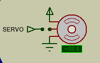 
- <b>1 Pantalla LCD </b> 
 Para visualizar informacion sobre el estado de la aplicacion
 
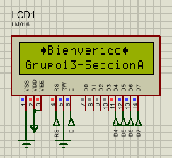 
- <b>1 Buzzer  </b>
 Para poder escuchar la alarma cuando se despachan los paquetes
 
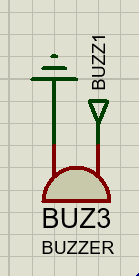 
- <b>1 Módulo Bluetooth</b>  
  Para poder recibir datos a travez de la aplicacion por medio de bluetooth
 
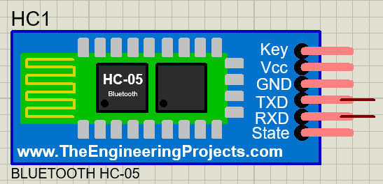 
- <b>40 Leds de dos colores </b> 
  Para simular el avance de los paquetes
 
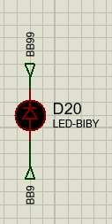 
- <b>8 Demultiplexores 74154 </b> 
  Para poder controlar los leds de una forma mas eficiente
 
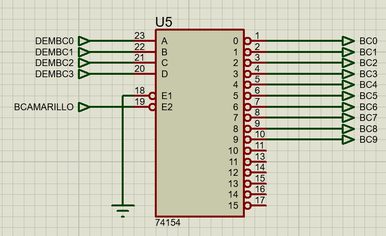 
- <b>4 drivers  L293D</b> 
 Para poder controlar algunos motores stepers
 
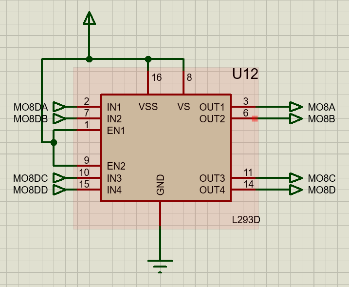 

## RED DE ARDUINOS
Para la desarrollar la red de arduinos se utilizó comunicación serial.

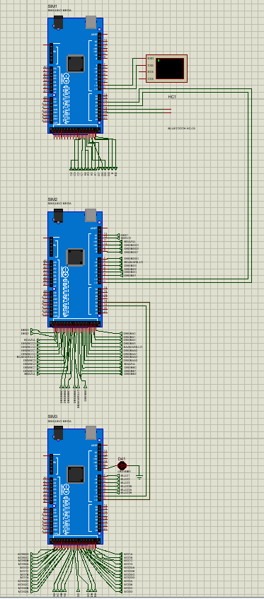 

Se utilizaron los arduinos de la siguiente manera:

- **Maestro :** El dispositivo maestro se encarga de:
    - Controlar la pantalla LCD
	- Recabar la información recibida
	- Guardar la información en memoria EEPROM
	- CRUD de Usuarios
	- Calcular estadísticas
	- Verificar el Login del usuario
  
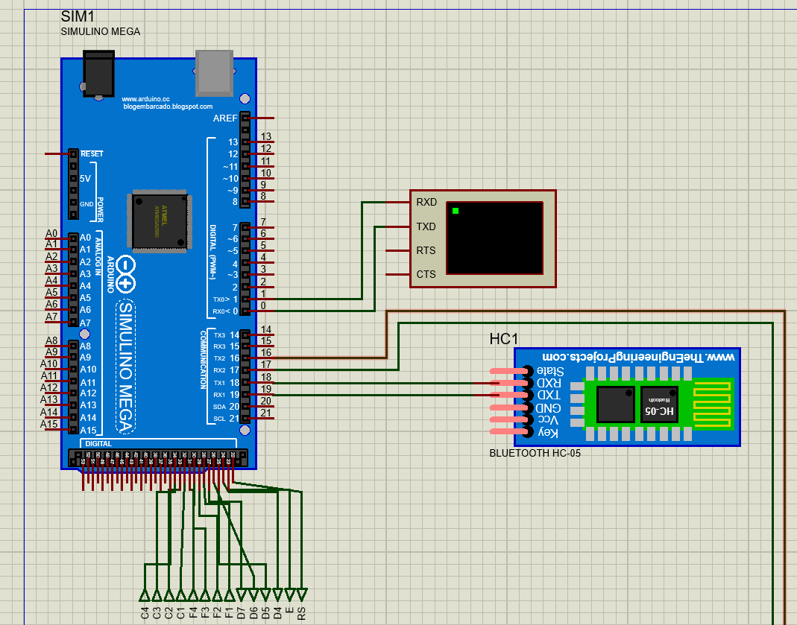 

- **Esclavo 1:** El dispositivo esclavo manejará:
	- El movimiento del paquete en la banda transportadora
	- Control de servomotor
	- Registro de cantidad de paquetes disponibles
  
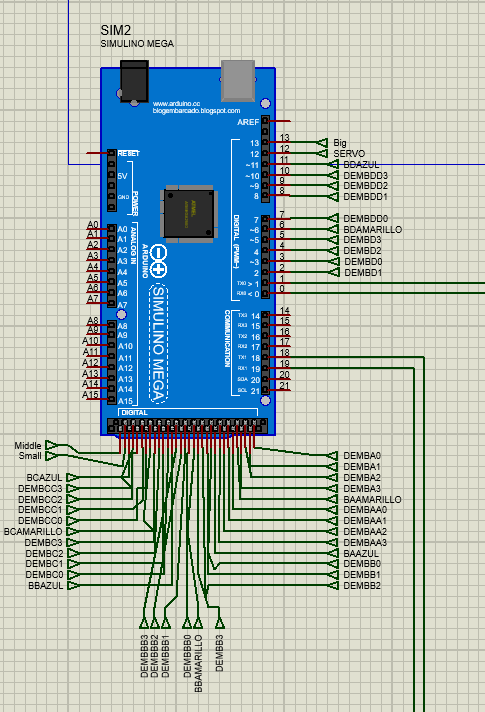 

- **Esclavo 2:** El dispositivo esclavo manejará:
	- Control de motores stepper
	- Indicador de envío de despacho por medio del buzzer

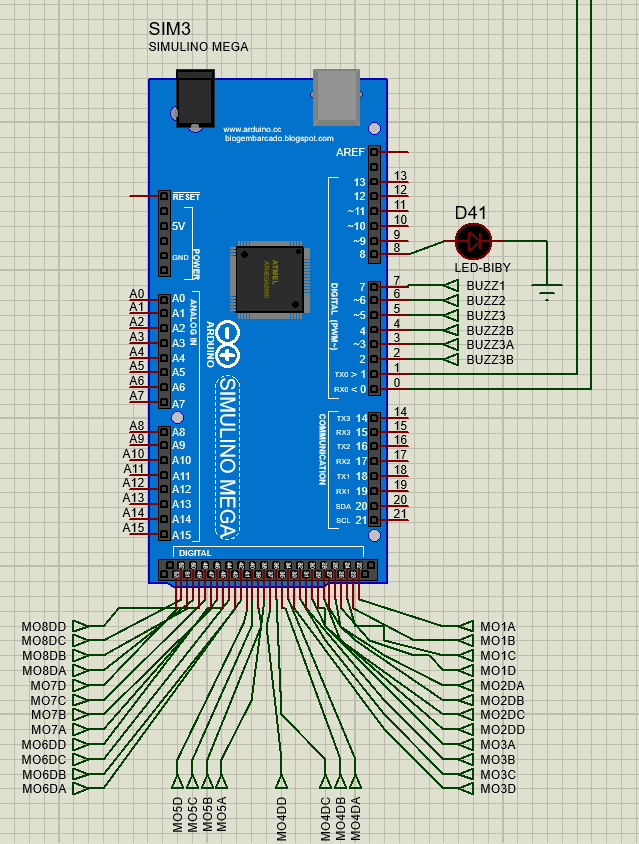 
	
## CODIGO UTILIZADO
### Maestro
Las variables globales nos permitirán definir las entradas, la salidas y manejar los datos correspondientes a los estados del mismo.  

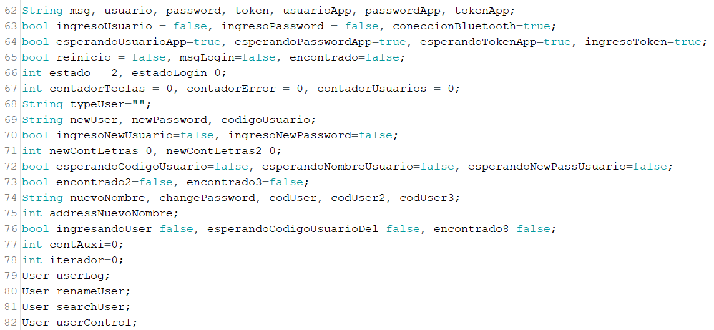

Se definieron los caracteres especiales que se mostrarán en la pantalla LCD.  

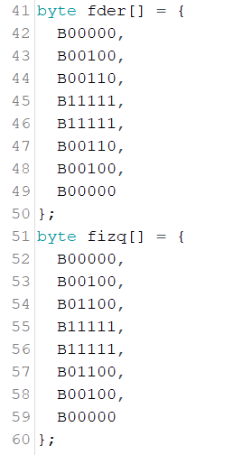

En la sección de declaración de pines se inicia la comunicación serial entre los tres arduinos por medio del comando Serial#begin(9600), donde # es el número de puerto serial del arduino maestro utilizado.

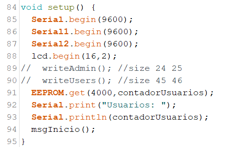

Con el método `msgInicio` se muestra el mensaje de inicio teniendo en la línea superior los caracteres especiales formando "🡆Bienvenido🡄" y en la línea inferior se tiene "Grupo13-SeccionA" de la pantalla LCD.

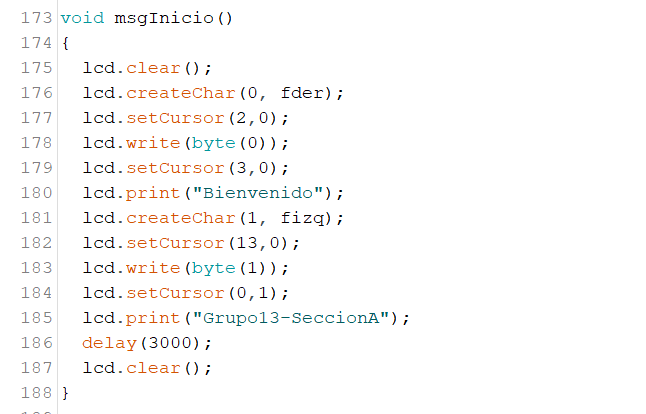

Se utilizó la variable `estado` para saber que debe de ejecutar el arduino maestro, ya sea iniciar sesión, utilizar la opción del CRUD, ver reportes, gestionar paquetes o cerrar sesión del administrador. 

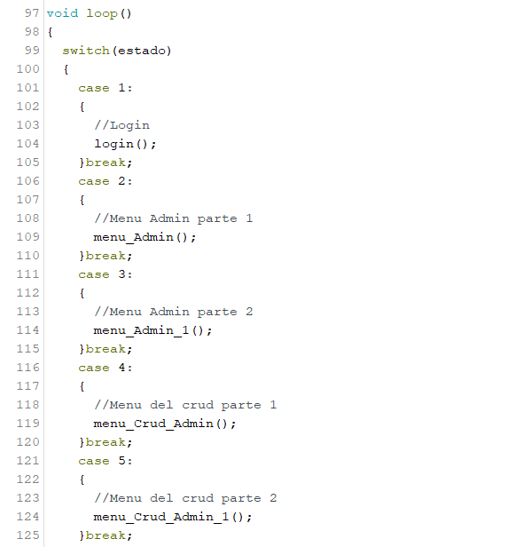

Para guardar la información recibida, así como los usuarios, se utilizó la memoria EEPROM usando los comandos EEPROM.get(), EEPROM.put() y EEPROM.read().

### Esclavo 1
Las variables globales nos permitirán definir las entradas, la salidas y manejar los datos correspondientes a los estados del mismo.

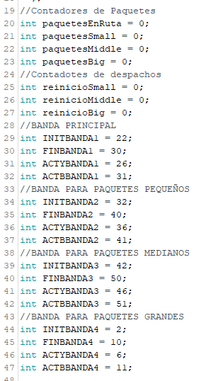

En la sección de declaración de pines se inicia la comunicación serial entre los tres arduinos por medio del comando Serial#begin(9600), donde # es el número de puerto serial del arduino maestro utilizado. 

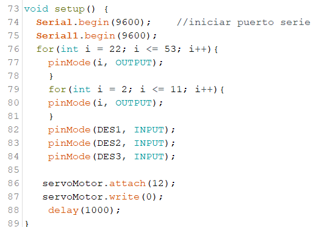

Se utilizó las funciones `paqueteSmall`, `paqueteMiddle` y `paqueteBig` para visualizar el movimiento del paquete por medio de leds. 

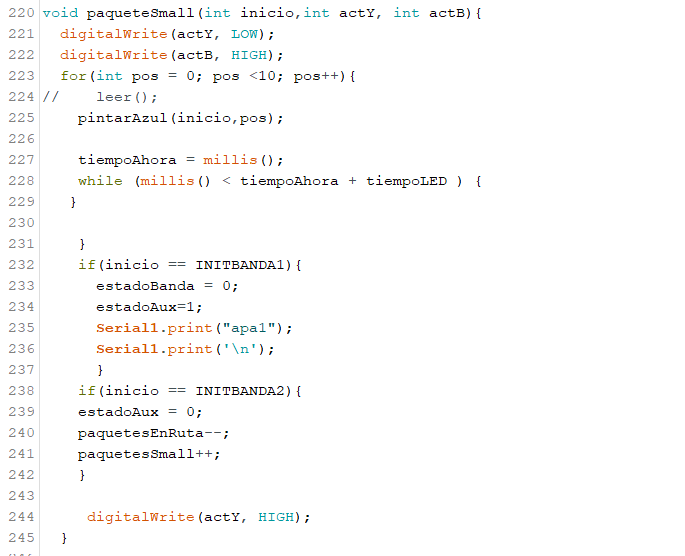

Para visualizar los paquetes se utilizó leds de dos colores junto con las funciones `pintarAzul` y `pintarAmarillo` para indicar el color de led a utilizar según el tamaño de paquete. 

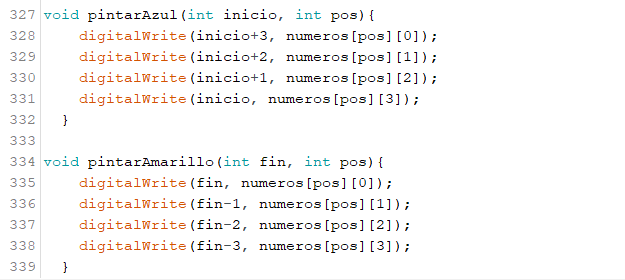

Se utilizó una variable `estadoBanda` y `estadoAux` para indicar el movimiento de motores según el tamaño de paquete.  
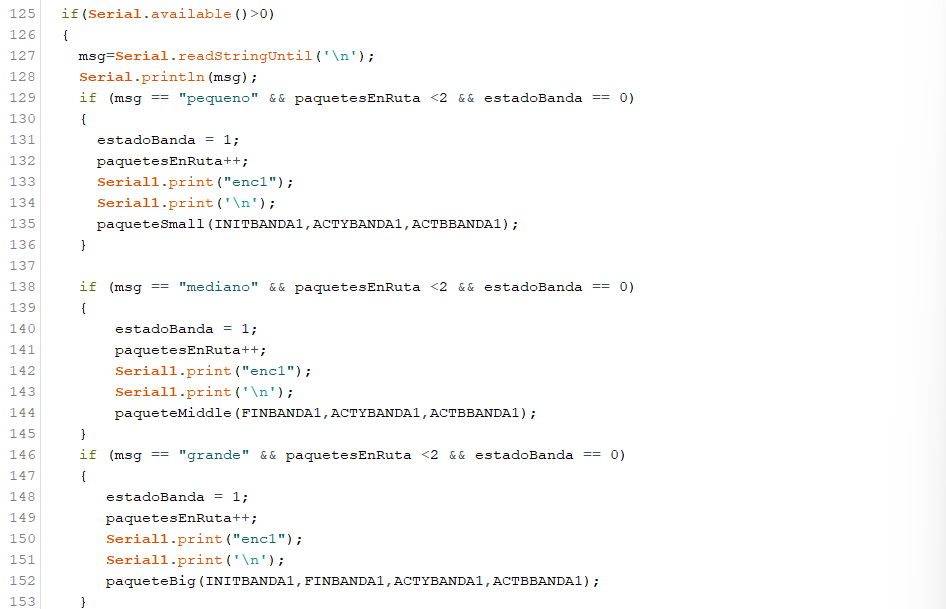

# Esclavo 2
Las variables globales nos permitirán definir las entradas, la salidas y manejar los datos correspondientes a los estados del mismo.

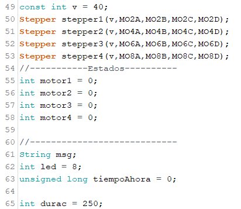

En la sección de declaración de pines se inicia la comunicación serial entre arduinos por medio del comando Serialbegin(9600).

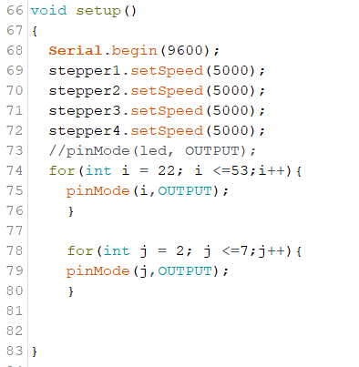

Se utilizó la función `motorCorrer` para lograr el movimiento del motor stepper. 

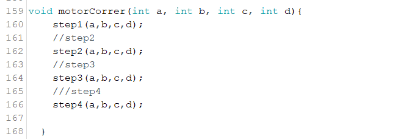

Se utilizó la función `buzz#` donde # es el número de linea de la banda transportadora en uso para lograr el tono según el despacho de paquetes.

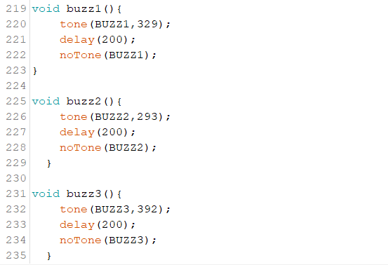

Se utilizó la variable `msg` para determinar el motor stepper o buzzer a activar. 

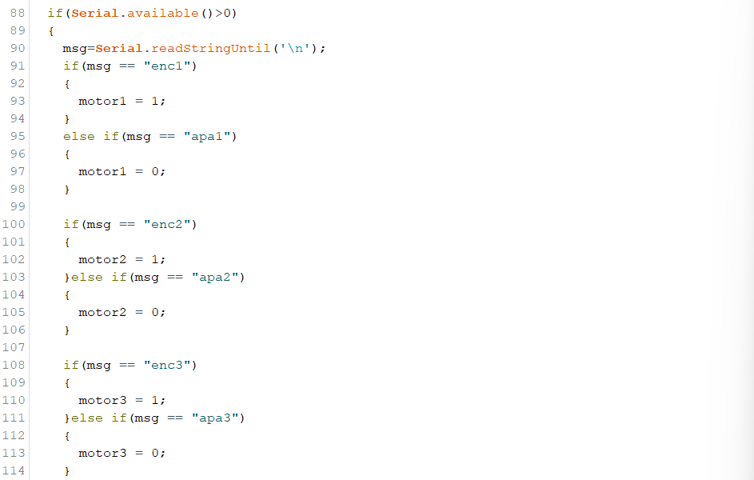
